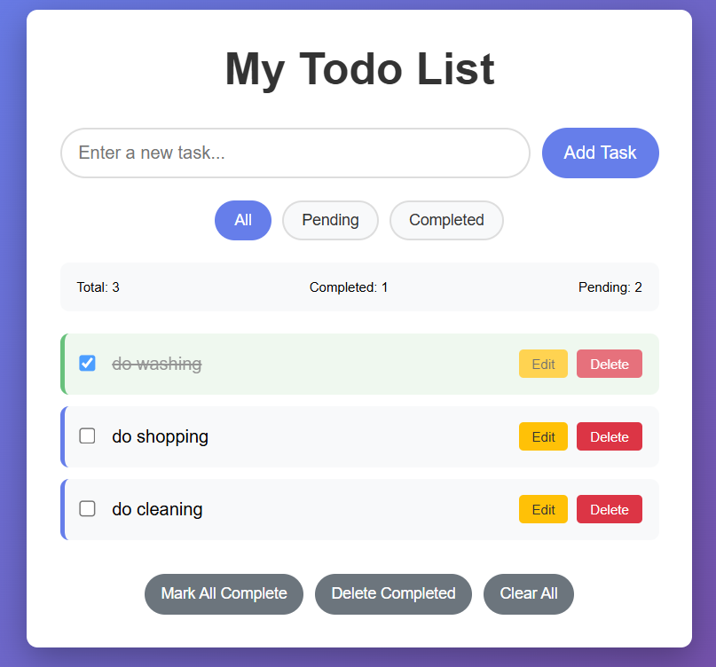

# Bug-Ridden Todo App

This is a **intentionally buggy** web application created for testing bug detection and fixing workflows. The app contains 33+ deliberately introduced bugs across UI, functionality, security, and performance areas.

## 🎯 Purpose

This application serves as a testing ground for:
- Bug detection tools and processes
- Manual testing and QA workflows  
- Automated bug fixing systems
- Developer training on common bug patterns

## 🚀 Quick Start

1. Open `index.html` in a web browser
2. Interact with the todo application
3. Notice various bugs and issues (they're intentional!)

## � App Screenshot



*The screenshot shows several visible bugs including invisible text, misaligned elements, and responsive design issues.*

## �🐛 Bug Categories

The app contains bugs in these areas:

### UI/CSS Bugs (15 bugs)
- Invisible text on gradient background
- Non-responsive design issues
- Poor spacing and alignment
- Missing hover states and focus indicators
- Broken animations and transitions

### JavaScript/Functionality Bugs (15 bugs)
- Missing error handling and validation
- Security vulnerabilities (XSS)
- Memory leaks and performance issues
- Poor event handling
- Data consistency problems

### UX/Accessibility Bugs (3 bugs)
- No confirmation dialogs for destructive actions
- Poor keyboard navigation
- Inadequate user feedback

## 📋 Bug Tracking

All bugs are documented in `bug_tickets.json` with:
- Unique bug IDs
- Severity and priority levels
- Reproduction steps
- Expected vs actual behavior
- File locations and line numbers

## 🔧 GitHub Integration

Use `github_issue_importer.py` to import all bugs as GitHub issues:

### Setup
```bash
pip install -r requirements.txt
```

### Configure
Edit `config.json` with your GitHub repository and token:
```json
{
  "repository": "your-username/your-repo",
  "github_token": "your_token_here"
}
```

### Import Issues
```bash
# Dry run (test without creating issues)
python github_issue_importer.py --config config.json --dry-run

# Create actual issues
python github_issue_importer.py --config config.json

# Create labels first
python github_issue_importer.py --config config.json --create-labels
```

### Alternative Command Line Usage
```bash
python github_issue_importer.py --repo owner/repo --token your_token --dry-run
```

## 📊 Bug Statistics

- **Total Bugs:** 33
- **Critical:** 1 (XSS vulnerability)
- **High Severity:** 6
- **Medium Severity:** 15  
- **Low Severity:** 11

## 🎨 Visual Bug Examples

When you open the app, you'll immediately notice:
1. **Text is barely visible** (missing color on gradient background)
2. **Elements are misaligned** (oversized checkboxes, poor spacing)
3. **Mobile layout breaks** (no responsive design)
4. **Buttons lack hover effects** (poor user feedback)
5. **Long text overflows** (no text wrapping)

## 🔍 Testing the Bugs

### Quick Bug Tour:
1. **Load the app** - Notice invisible/hard-to-read text
2. **Add a todo** - Try adding very long text
3. **Resize window** - See responsive design failures
4. **Try mobile view** - Notice broken layout
5. **Delete todos** - No confirmation dialogs
6. **Edit todos** - Outdated prompt dialogs
7. **Add HTML in todos** - XSS vulnerability
8. **Check browser console** - JavaScript errors

### Systematic Testing:
- Follow the reproduction steps in `bug_tickets.json`
- Each bug has detailed steps to trigger the issue
- Test on different browsers and screen sizes
- Use browser dev tools to inspect issues

## 🛠️ Fixing the Bugs

This app is designed to be used with bug-fixing tools and processes. The bugs range from simple CSS fixes to complex JavaScript refactoring.

### Bug Difficulty Levels:
- **Easy:** CSS styling fixes (colors, spacing, responsive design)
- **Medium:** JavaScript logic improvements (validation, error handling)
- **Hard:** Security fixes (XSS prevention) and performance optimization

## 📁 Project Structure

```
testApp/
├── index.html              # Main HTML file (contains structural bugs)
├── styles.css              # CSS file (contains UI/styling bugs)  
├── script.js               # JavaScript file (contains logic bugs)
├── bug_tickets.json        # Complete bug documentation
├── github_issue_importer.py # Script to import bugs to GitHub
├── requirements.txt        # Python dependencies
├── config.json            # Configuration template
└── README.md              # This file
```

## 🚨 Security Warning

This application contains **intentional security vulnerabilities** including XSS. Only use in safe, isolated environments for testing purposes.

## 📝 License

This is a testing/educational tool. Use freely for learning and testing bug detection/fixing workflows.

---

**Remember:** Every bug in this application is intentional and documented. Happy bug hunting! 🐛🔍
